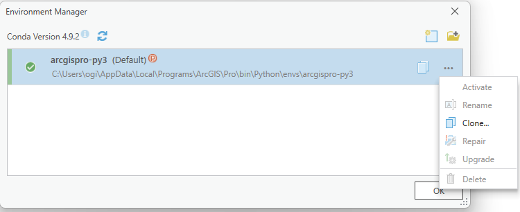
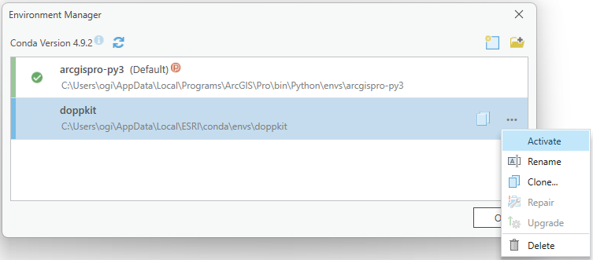
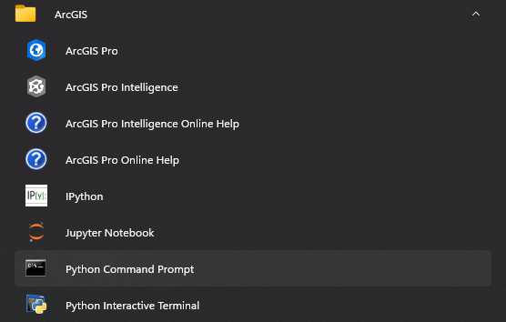
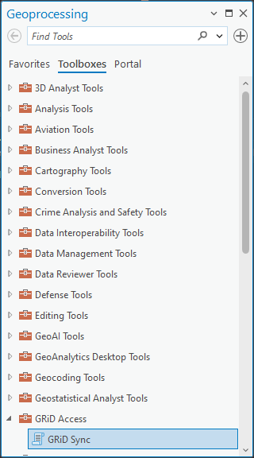

# doppkit-esri-toolbox

ArcGIS Pro Toolbox to Interact with GRiD.  The toolbox provides ArcGIS users to interact with the doppkit utility to
retrieve exports from GRiD.

## Installation

For users in restricted network environments, they can run the following command, and the environment cloning happens in an offline fashion.  After doing running the command here proceed below.  The `doppkit-esri-toolbox` and its dependencies will need to be stored in a directory that needs to be referenced when installing the library.

After running the commands below, you can resume from Step 6 in the "online" installation.

```doscon
(arcgispro-py3) > conda create --clone arcgispro-py3 ^
--name doppkit ^
--offline ^
--chanel ^
file://"C:\Program Files\ArcGIS\Pro\bin\Python\envs\arcgispro-py3"
...
(arcgispro-py3) > activate doppkit
(doppkit) > pip install --find links <path-to-directory> doppkit-esri-toolbox
```

Installation of the doppkit toolkit into ArcGIS pro can be done via the following steps.

1. Clone the default python environment that ESRI provides.

    

2. Name your new environment to something that you will recognize

    

3. Activate the newly created environment
    
    

4. Close ArcGIS Pro, and open the Python Command Prompt
    
    

5. Install the toolbox by running `pip install doppkit-esri-toolbox`
    
    ```doscon
    (doppkit) C:\Users\ogi\AppData\Local\ESRI\conda\envs\doppkit> pip install doppkit-esri-toolbox
    ```

6. Start ArcGIS in the Geoprocessing tab, look at the list of toolboxes and find GRiD Sync
    
    

7. When the toolbox is loaded, it is ready for use
    
    

## Dependencies

* ArcGIS Pro 3.0+ 
* doppkit
* aiofiles
* httpx
* werkzeug
* click
* rich

## License

Apache v2.0


